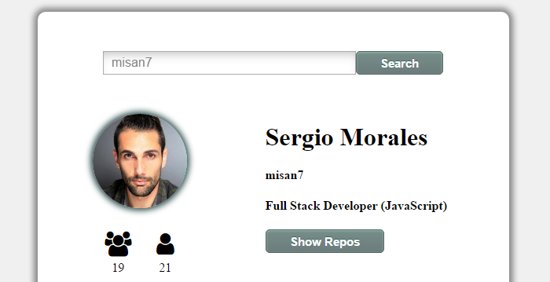
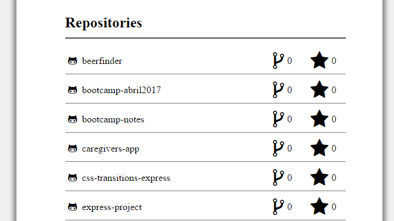
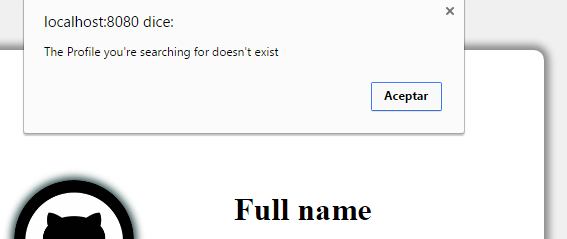

# GitHub ProSearcher

This repository contains a _GitHub Profile Searcher_. I used the [GitHub API](https://developer.github.com/v3/) to create the profile and repos finder. The code is basically `Vanilla JavaScript`, `CSS` and `HTML`.

### You can see the repos of the user, forks and stars that has on his repos.

### If the username you type doesn't exist the app will throw an alert with the error ocurred.

